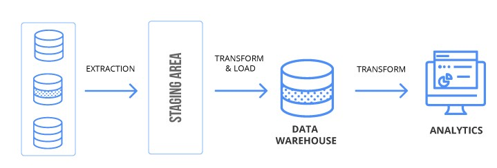

# Data Warehousing and Business Intelligence project

This project is related to the DWBI module in 1st semester of 3rd year. Following tasks are completed and demonstrated for the Baseball Databank.

## Data set selection
The chosen OLTP data set is about Baseball tournaments and related areas. It has various kind of tables with huge number of records. BaseballPlayers, Fielding, Salaries, SeriesPost and Teams were the tables used as data source. Data set is from [Kaggle](https://www.kaggle.com/)

## Preparation of data sources
- BaseballPlayers - All the details about the players (Database table)
- Fielding - Data of Fielding stasitics. (CSV file)
- Salaries – Details of players’ salaries. (CSV file)
- SeriesPost – Post-season series information (TEXT file)
- Teams – Details about teams (TEXT file)

## Solution architecture 

## Data warehouse design & development 
Snowflake schema is designed as the dimensional model.

## ETL development 
Data extraction, transformation and loading using SSIS.

## SSAS Cube implementation
Creating data source, data source view and deploying the SSAS cube.

## Demonstration of OLAP operations
Connecting Excel workbook to the cube using PowerPivot. Demonstrating Roll-up, Drill-down, Slice, Dice, Pivot.

## Tools and technologies
- MS SQL Server
- SSIS
- SSAS
- MS Excel

